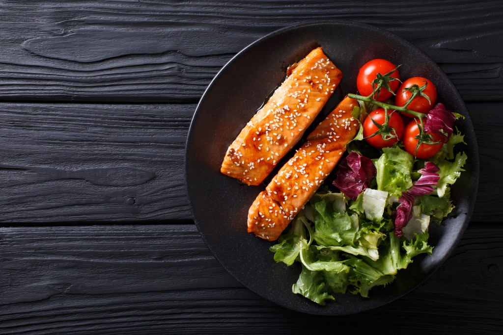

# PALMAH'S Foods Recipe Website

## Introduction

### Purpose

This documentation serves as a comprehensive guide for developers, designers, and stakeholders involved in the PALMAH'S Foods Recipe website project. It provides detailed information about the structure, functionality, and best practices implemented in the website's codebase.

### Target Audience

- Front-end Developers
- UX/UI Designers
- Project Managers
- Quality Assurance Testers
- Stakeholders and Client Representatives

### Project Overview

PALMAH'S Foods Recipe is a responsive web application designed to showcase various food recipes. It provides an intuitive interface for users to browse, search, and save their favorite recipes. Key features include a mobile-friendly design, search functionality, and categorized recipe listings.

## Technical Specifications

### Development Environment

- **Code Editor:** [Specify the recommended code editor, e.g., Visual Studio Code]
- **Version Control:** Git
- **Package Manager:** npm

### Technologies Used

- HTML5
- CSS3 (with Tailwind CSS framework)
- JavaScript (ES6+)
- Tailwind CSS for responsive design
- Font Awesome for icons
- AOS library for scroll animations

### Browser Compatibility

The website is designed to be compatible with the following browsers:

- Google Chrome (latest 2 versions)
- Mozilla Firefox (latest 2 versions)
- Safari (latest 2 versions)
- Microsoft Edge (latest 2 versions)

### Performance Considerations

- Optimized assets (images, CSS, JavaScript)
- Efficient use of Tailwind CSS for reduced CSS file size
- Lazy loading of images and components
- Minimized HTTP requests

## HTML Structure

### Document Type and Language

```html
<!DOCTYPE html>
<html lang="en">
The document is defined as HTML5 with English as the primary language.

Meta Tags
html
Copy code
<meta charset="UTF-8">
<meta name="viewport" content="width=device-width, initial-scale=1.0">
These meta tags ensure proper character encoding and responsive behavior across devices.

Title and Favicon
html
Copy code
<title>PALMAH'S Foods Recipe | All in One Place</title>
<link rel="shortcut icon" href="src/images/icon.png" type="image/x-icon">
The title is descriptive and includes the brand name. A favicon is specified for brand recognition in browser tabs.

External Resources
html
Copy code
<link href="/dist/output.css" rel="stylesheet">
<link rel="stylesheet" href="https://cdnjs.cloudflare.com/ajax/libs/font-awesome/6.4.0/css/all.min.css">
<link rel="stylesheet" href="src/input.css">
External CSS files are linked, including Tailwind CSS output, Font Awesome icons, and custom styles.

Body Structure
The body is structured into three main sections:

Header (navigation)
Main content area
Footer
Header Component
Navigation Bar
html
Copy code
<header>
    <nav class="container flex justify-between py-1.5 px-[1.3rem] lg:px-[0.2rem]">
        <!-- Navigation content -->
    </nav>
</header>
Logo
html
Copy code
<a href="index.html" class="text-2xl text-black font-black" data-aos="fade-down" data-aos-duration="1000">RECIPE GENIUS</a>
The logo is a text-based anchor tag using Tailwind classes for styling and includes AOS attributes for animation.

Mobile Menu Button
html
Copy code
<button class="md:hidden text-2xl text-black fixed top-[1.2rem] right-1 z-[99] rounded-full bg-[#f7f7f7] px-[0.7rem] flex justify-center items-center pt-[0.2rem]" id="mobile-btn">☰</button>
This button is visible only on mobile devices (md:hidden class).

Navigation Links
html
Copy code
<ul class="flex mb-0 gap-2 justify-center md:justify-normal items-center">
    <li class="text-[1.3rem] md:text-[1.2rem] font-semibold md:font-normal" data-aos="fade-down" data-aos-duration="1100">
        <button id="categories-btn">Categories</button>
    </li>
    <li class="text-[1.3rem] md:text-[1.2rem] font-semibold md:font-normal" data-aos="fade-down" data-aos-duration="1300">
        <button id="favorites-btn">Favorites</button>
    </li>
</ul>
Each link is a button element for better accessibility and interaction handling.

Search Form
html
Copy code
<form class="flex justify-center md:justify-start gap-0 rounded-3xl overflow-hidden" data-aos="fade-down" data-aos-duration="1500">
    <input type="text" class="border border-gray-400 py-[0.6rem] px-1 lg:px-2 rounded-s-3xl outline-none bg-transparent font-bold placeholder:font-normal uppercase placeholder:normal-case" placeholder="Enter food here." id="input">
    <button class="bg-black text-white rounded-e-3xl py-[0.6rem] px-1 lg:px-2" id="search-btn">SEARCH</button>
</form>
The form uses Flexbox for layout and includes responsive classes for different screen sizes.

Main Content Area
Grid Layout
html
Copy code
<main class="px-1 lg:px-0 py-5 container grid grid-cols-2 md:grid-cols-4 gap-[0.4rem] lg:gap-2 relative min-h-screen" id="food-container">
    <!-- Main content -->
</main>
This grid adapts from 2 columns on mobile to 4 columns on larger screens.

Hero Section
Call-to-Action
html
Copy code
<div class="bg-navyBlue w-full col-span-3 md:col-span-2 p-1 pt-2 md:p-3 rounded-[3rem] flex flex-col justify-between relative" data-aos="fade-right" data-aos-duration="1000">
    <!-- CTA content -->
</div>
Includes a headline, a category tag, and a call-to-action button.

Featured Image
html
Copy code
<div class="w-full col-span-3 md:col-span-1 bg-red-200 rounded-[3rem] overflow-hidden" data-aos="fade-left" data-aos-duration="1000">
    
</div>
Displays a featured image alongside the CTA, with responsive column spans.

Promotional Section
html
Copy code
<div class="w-full col-span-3 bg-brown rounded-[3rem] py-2 flex flex-col md:flex-row gap-1 p-2 relative overflow-hidden" data-aos="fade-up" data-aos-duration="1000">
    <!-- Promotional content -->
</div>
Promotes a specific recipe using a combination of images and text.

Food Items Display
The main area where food items will be displayed is represented by the grid container. Individual food items are dynamically inserted into this container using JavaScript.

Footer Component
Website Information
html
Copy code
<div class="mt-2 mb-3">
    <a href="index.html" class="text-white text-2xl font-black">PALMAH'S RECIPE HUB</a>
    <p class="text-gray-300 text-[1.4rem]">PALMAH'S Food Recipe | All in One Place</p>
</div>
Designer Credits
html
Copy code
<a href="https://github.com/palmahAnders/recipeGeniusApp.git" target="_blank" class="text-gray-400 text-sm md:text-base">Designed and Built by PALMAH ANDERSON_GH</a>
Provides attribution and links to the designer's GitHub profile.

CSS Styling
Tailwind CSS Usage
Tailwind CSS is extensively used throughout the HTML for styling. Key utility classes include:

Flexbox: flex, justify-between, items-center
Grid: grid, grid-cols-2, md:grid-cols-4
Spacing: px-1, py-5, gap-2
Typography: text-2xl, font-black, text-center
Colors: bg-black, text-white
Responsive Design: md:hidden, lg:px-0
Custom CSS (input.css)
While most styling is handled by Tailwind, a custom CSS file (input.css) is linked for additional styles:

html
Copy code
<link rel="stylesheet" href="src/input.css">
Responsive Design Techniques
Responsive design is achieved through:

Tailwind's responsive prefixes (md:, lg:)
Grid layout with responsive column counts
Flexbox for flexible layouts
Custom responsive classes for specific components
Color Scheme and Typography
Color Scheme:

Navy blue for primary sections
Black and white for contrast
Brown and light brown for accent colors
Typography:

Large text: text-4xl, md:text-6xl
Medium text: text-[1.3rem], md:text-[1.2rem]
Small text: text-sm, md:text-base
JavaScript Functionality
Mobile Navigation Toggle
The mobile navigation is toggled using JavaScript. Relevant elements include:

html
Copy code
<button id="mobile-btn">☰</button>
<div id="mobile-nav">
    <!-- Navigation content -->
</div>
<button id="close-btn">×</button>
Getting Started
Cloning the Repository
To get started with this project, follow these steps:

Clone the Repository

Open your terminal and run the following command to clone the repository:

bash
Copy code
git clone https://github.com/palmahAnders/recipeGeniusApp.git
Navigate to the Project Directory

Change into the project directory:

bash
Copy code
cd recipeGeniusApp
Install Dependencies

If the project uses npm, install the required dependencies:

bash
Copy code
npm install
Run the Development Server

Start the development server to view the project locally:

bash
Copy code
npm start
Open the Project

Open your browser and go to http://localhost:3000 (or the port specified) to view the project.

Make Changes

Modify the code as needed and use your preferred editor to make updates.

Push Changes

Commit and push changes to your own repository:

bash
Copy code
git add .
git commit -m "Your commit message"
git push origin main
Contributing
Feel free to submit issues, fork the repository, and create pull requests to contribute to the development of PALMAH'S Foods Recipe website.

License
This project is licensed under the MIT License.

Contact
For any questions or feedback, please contact Your Name.

sql
Copy code

Feel free to adjust any sections as needed, especially the "Development Environment" and "Contact" sections if there are specific details you'd like to include.


